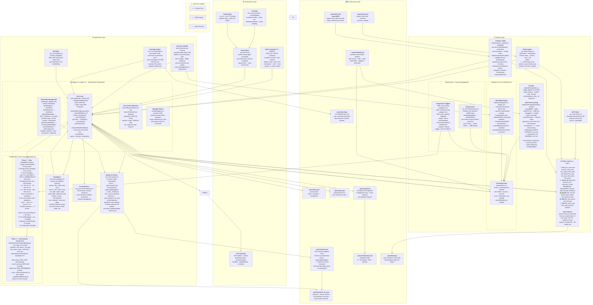

# spica - AI coding agent CLI

```
              _)
   __|  __ \   |   __|   _` |
 \__ \  |   |  |  (     (   |
 ____/  .__/  _| \___| \__,_|
       _|
```

AI coding agent for the terminal. Write, edit, run commands — interactive or single-task.

[](https://opensource.org/licenses/MIT)
[](https://nodejs.org)
[](https://www.typescriptlang.org/)

[English](README.md) | [中文](README_CN.md)

## Install

```bash
git clone https://github.com/zisonzishen0415-stack/spica-cli
cd spica-cli
npm install && npm run build && npm link
```

## Use

```bash
spica set <name> <base-url> <api-key> <model>   # add a provider
spica use <name>                                 # switch to it
spica                                            # interactive
spica run "fix the bug"                          # single task
```

## Features

- **Tool batching** — parallel reads, parallel writes (conflict-aware), one LLM round-trip per turn
- **tiktoken-accurate counting** — real tokenizer, not heuristics; compression at 60% window
- **Two-phase compression** — instant rule-based truncation + background LLM summarization
- **8K output cap** — large tool results truncated; fetch more with `offset`/`limit`
- **Prompt cache aware** — prefix stabilization for OpenAI cache hits
- **Checkpoints** — file snapshots in `.spica/snapshots/`, no git pollution, auto-pruned
- **Learnings** — `.spica/learnings/` persists corrections across sessions
- **Session management** — `/archive`, `/clear`, `/history`; archive with summary, never delete
- **14 built-in skills** — brainstorming, TDD, debugging, code review, verification, more
- **Interrupt-safe** — ESC ESC preserves tool results and message ordering
- **Sub-agents** — `task` tool dispatches 3 parallel agents
- **Windows compatible** — PowerShell fallback, cross-platform bin scripts
- **MCP extensible** — Model Context Protocol for external tools
- **TUI** — streaming output, thinking animation, compact mode, resize handling

## Architecture

> See [docs/architecture.mermaid](docs/architecture.mermaid) for source. Rendered: [docs/architecture.png](docs/architecture.png)

```mermaid
graph TB
    subgraph PRES["🎨 Presentation Layer"]
        direction TB
        TUI["<b>TUI Mode</b><br/>full-screen terminal · screenManager<br/>scrollback · status bar · thinking anim"]
        SIMPLE["<b>Simple Mode</b><br/>--no-tui / non-TTY<br/>readline · plain text output"]
        CMD["<b>Slash Commands</b> (16 handlers)<br/>/help /init /history /summary /compact<br/>/archive /view /rename /delete /clear<br/>/reset /new /checkpoint /skill /mcp<br/>/queue /q /undo /status"]
        IQ["<b>Input Queue</b><br/>max 50 · buffers during processing<br/>auto-drain after runLoop"]
        UI["<b>UI Components</b><br/>diff renderer · spinner<br/>streaming output · bracketed paste"]
    end

    subgraph APP["⚙️ Application Layer"]
        direction TB

        subgraph AGENT_SUB["SpicaAgent (src/agent.ts)"]
            direction TB
            AGENT["<b>Core Loop</b><br/>runLoop(prompt, maxIter=50)<br/>  → applyPendingSummary<br/>  → token check (60% trigger)<br/>  → startNonBlockingCompression<br/>  → callLLMWithRetry (10×, exp backoff)<br/>  → syncFullHistory (provider→_fullHistory)<br/>  → executeTools (parallel/batch)<br/>  → loop until LLM returns text<br/><br/><b>Three-Way Message Split</b><br/>_fullHistory: append-only, session persistence<br/>provider.msgs: LLM API context, compressed<br/>toolDefs: separate `tools` API param"]
        end

        GATE["<b>Skill Gate</b><br/>8 intent categories<br/>SKILL HINT injection"]

        subgraph COMPRESS["Compression v3 (src/core/compression.ts)"]
            direction TB
            COMP1["<b>Phase 1 — Rule Truncation</b> (instant)<br/>① Read cachePrefixEnd → exempt prefix msgs<br/>② Score: user=10, write/bash=9, [COMPACTED]=10<br/>③ Graduated keep: 15%-50%, floor=10 cap=40%<br/>④ Per-role limits: user=∞, tool=1.5×, truncated=2×<br/>⑤ llm.setMessages → RESTORE cachePrefixEnd"]
            COMP2["<b>Phase 2 — LLM Summary</b> (background)<br/>buildSummaryPrompt: tool names + 500-char results<br/>Heavy drop (>50%): WAIT sync → inject NOW<br/>Light drop (≤50%): BACKGROUND → deferred for next"]
        end

        EVENTS["<b>Event Bus (42 events)</b><br/>Core: stream · reasoning · message<br/>Tools: tool_call · tool_result<br/>Compress: context_compressed · context_warning<br/>Subagent: sub_agent_start/done/error<br/>  sub_agent_tool_call/tool_result<br/>Monitor: monitor_event · monitor_error<br/>Hooks: hook_blocked/warning/log"]
        INTR["<b>Interrupt Handler</b><br/>AbortController per runLoop<br/>cancelSeq high-water mark<br/>ESC×2 · 200ms debounce<br/>preserves partial tool results"]
        SESSION["<b>Session & Archive</b><br/>two-state model (decoupled)<br/>active → session.json (from _fullHistory)<br/>historical → sessions/&lt;id&gt;.json<br/>LLM summary on archive · keep 50"]
        SUB["<b>Sub-Agents (4 types)</b><br/>explore: 90s→180s · review: 120s→240s<br/>fix: 180s→360s · build: 300s→600s<br/>adaptive timeout · worktree isolation<br/>max 3 parallel · model override"]
        PMON["<b>ProcessMonitor</b><br/>PID tracking · SIGKILL escalation"]
        LEARN["<b>Learnings System</b><br/>6 correction patterns<br/>.spica/learnings/YYYY-MM-DD-topic.md<br/>injected into variable system prompt"]
    end

    subgraph DOMAIN["🧠 Domain Layer"]
        direction TB

        subgraph LLM_SUB["LLMClient (src/llm/LLMClient.ts)"]
            LLM["<b>Streaming Client</b><br/>temperature=0.3 · stream+reasoning<br/>rate limiter (req+tok/min)<br/>retry: 10× exponential backoff<br/><b>AbortSignal Dedup</b><br/>linkExternalSignal with handler-ref slots<br/>prevents MaxListenersExceeded"]
        end

        PROV["<b>Provider</b> (OpenAICompatible.ts)<br/>Single adapter for all APIs<br/>model+models alias→ID resolution<br/><b>Split-Prefix Caching</b><br/>msg[0]=stable (AGENTS.md ~3.8K tok)<br/>msg[1]=variable (skills, learnings)<br/>cachePrefixEnd preserved across compression (v3)"]
        TOK["<b>TokenCounter + Compression v3</b><br/>tiktoken real tokenizer (o200k_base)<br/>cache-prefix-aware truncation<br/>graduated keep tiers (10–25 msgs)<br/>2-phase: rule trunc + LLM summary<br/>sync summary on heavy drop (>50%)<br/>double-truncation prevention<br/>trigger: 60% · target: 40%"]
        TOOLS["<b>33 Tools</b> (registry.ts + impl/)<br/>📁 File (11) · 🔍 Search (4)<br/>💻 Shell (5): bash(sandbox) monitor task_stop git workspace<br/>✅ Quality (5) · 🌐 Web (3) · 📋 Task (5)<br/>Auto: syntax check · tool cache (30s TTL)<br/>sandbox (bwrap) · replace_all · 8K output cap"]
        MCP["<b>MCP Client</b><br/>@modelcontextprotocol/sdk<br/>external tool servers · built-in: playwright"]
        HOOKS["<b>Hooks System</b><br/>PreToolUse / PostToolUse<br/>block · confirm · warn · log<br/>global + project layers · project ≤ global"]
        SKILLS["<b>14 Built-in Skills</b><br/>brainstorming · systematic-debugging<br/>test-driven-development · verification<br/>executing-plans · writing-plans<br/>dispatching-parallel-agents<br/>subagent-driven-development<br/>requesting-code-review · receiving<br/>finishing-a-development-branch<br/>using-git-worktrees · writing-skills<br/>using-superpowers"]
    end

    subgraph INFRA["💾 Infrastructure Layer"]
        direction TB
        GLOBAL["<b>~/.spica/settings.json</b><br/>providers (model aliases)<br/>MCP servers · skills · hooks"]
        ACTIVE["<b>.spica/session.json</b><br/>active · _fullHistory (never truncated)"]
        HIST["<b>.spica/sessions/&lt;id&gt;.json</b><br/>historical · one per archive"]
        STATE["<b>.spica/state.json</b> · todos/decisions"]
        TASKS["<b>.spica/tasks.json</b> · auto-restored"]
        LEARNINGS["<b>.spica/learnings/</b> · YYYY-MM-DD-topic.md"]
        SNAPS["<b>.spica/snapshots/</b> · checkpoint snapshots (keep 20)"]
        CHKJSON["<b>.spica/checkpoints.json</b> · metadata index"]
        BACKUPS["<b>.spica/backups/</b> · auto on write/edit"]
        PSKILLS["<b>.spica/skills.json · skills/</b> · project overrides"]
        PHOOKS["<b>.spica/hooks.json</b> · must ≥ global strictness"]
    end

    TUI --> IQ
    SIMPLE --> IQ
    CMD --> AGENT
    IQ --> AGENT
    AGENT <--> LLM
    PROV --> LLM
    TOK --> LLM
    LLM --> AGENT
    AGENT --> COMP1
    COMP1 --> COMP2
    TOK --> COMP1
    COMP2 -.-> AGENT
    AGENT --> TOOLS
    MCP --> TOOLS
    TOOLS --> AGENT
    AGENT --> EVENTS
    EVENTS --> UI
    INTR --> AGENT
    INTR --> LLM
    AGENT --> SESSION
    SESSION --> ACTIVE
    ACTIVE --> HIST
    AGENT --> SUB
    SUB --> AGENT
    AGENT --> PMON
    LEARN --> AGENT
    GATE --> AGENT
    HOOKS --> AGENT
    HOOKS --> TOOLS
    SKILLS --> AGENT
    SKILLS --> TOOLS
    GLOBAL --> LLM
    GLOBAL --> PROV
    AGENT --> STATE
    AGENT --> TASKS
    SESSION --> HIST
    LEARN --> LEARNINGS
    AGENT --> SNAPS
    SNAPS --> CHKJSON
    TOOLS --> BACKUPS
    PSKILLS --> SKILLS
    PHOOKS --> HOOKS
```





> [Simplified version](docs/architecture-simplified.png) · [Source (English)](docs/architecture.mermaid) · [Source (中文)](docs/architecture_cn.mermaid)<br/>
> Render: `bash scripts/render-architecture.sh`

## Tools

| Category | Tools |
|----------|-------|
| File | `read` `write` `edit` `file_multi_edit` `file_replace` `file_insert` `file_delete` `file_copy` `file_move` `file_exists` `file_patch` |
| Search | `glob` `grep` `directory_list` `directory_create` |
| Shell | `bash` `monitor` `task_stop` `git` `workspace` |
| Quality | `lint` `test` `format` `code_health` `test_quality_check` |
| Web | `web_search` `web_fetch` `gh` |
| Task | `todo_write` `todo_read` `task` `skill` `question` |

## Commands

| Command | Description |
|---------|-------------|
| `/help` | List commands |
| `/init` | Initialize AGENTS.md for current project |
| `/archive` | Archive session + summary, start new |
| `/history` | Browse past sessions or message history |
| `/view` | View a session in detail |
| `/rename` | Rename a session |
| `/delete` | Delete a session |
| `/clear` | Clear current session |
| `/reset` | Reset agent state |
| `/new` | Start fresh session |
| `/summary` | Session progress summary |
| `/compact` | Compress context |
| `/checkpoint` | Checkpoint management (list, show, restore, clean) |
| `/skill` | Skill management (list, install, uninstall) |
| `/mcp` | MCP management (status, init, tools, disconnect) |
| `/status` | Session status (tokens, model, branch) |
| `/queue` | Show or undo queued inputs |
| `/q` | Shortcut for /queue |

## Config

```
~/.spica/settings.json    # global
<project>/.spica/         # per-project
```

## Dev

```bash
npm run dev      # dev mode (tsx)
npm run build    # build
npm test         # tests (vitest)
npm run lint     # lint
```

## Docs

- [MANUAL.md](docs/MANUAL.md)
- [CONTRIBUTING.md](docs/CONTRIBUTING.md)

## License

MIT
