# spica — AI Coding Agent CLI

```
              _)
   __|  __ \   |   __|   _` |
 \__ \  |   |  |  (     (   |
 ____/  .__/  _| \___| \__,_|
       _|
```

AI coding agent for the terminal. Write, edit, run commands — interactive or single-task.

[](https://opensource.org/licenses/MIT)
[](https://nodejs.org)
[](https://www.typescriptlang.org/)

[English](README.md) | [中文](README_CN.md)

---

## Abstract

Spica is a terminal-native AI coding agent. It maintains a persistent session across turns, executes tools (file ops, shell, git, web), and compresses context to stay within LLM context windows. The architecture is layered — Presentation → Application → Domain → Infrastructure — with a 4-layer compression waterfall, real tiktoken counting, sub-agent dispatch, and interrupt-safe execution. Built in TypeScript ESM, targeting any OpenAI-compatible API.

---

## 1. Architecture Overview

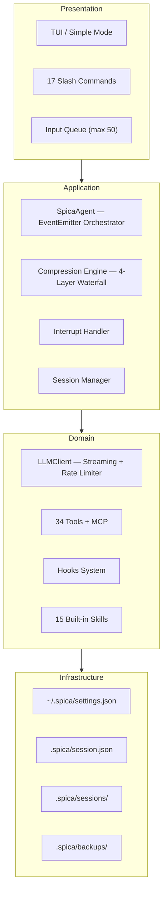

**Three-way message split** — the core architectural invariant:

| Store | Purpose | Truncated? |
|-------|---------|------------|
| `_fullHistory` | Session persistence (`session.json`) | Never — append-only |
| `provider.msgs` | LLM API context | Yes — compression waterfall |
| `toolDefs` | API `tools` parameter | No — lazy-loaded, saves ~1,500 tok/call |

System prompts exist ONLY in `provider.msgs`, never synced to `_fullHistory`. This keeps session files ~5,500 tokens lighter.

---

## 2. Agent Core Loop

The agent processes user input through a loop: send to LLM → receive response → execute tools → continue. A unified state machine governs all lifecycle transitions.

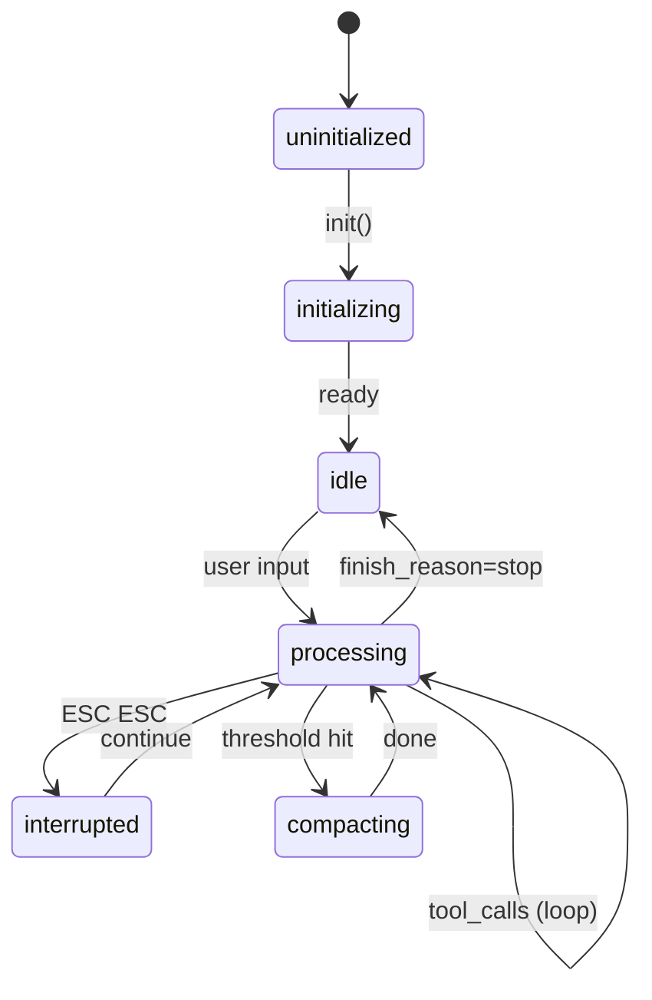

### 2.1 Processing Pipeline

```
processInput(prompt)
  │
  ├─ 1. Token check (adaptive threshold by context window size)
  │      └─ Over threshold → manageContext(target)   [see §3]
  │
  ├─ 2. Inject ProgressTracker context block
  │      └─ Structured progress record, survives compression
  │
  ├─ 3. callLLMWithRetry(prompt, toolDefs, maxRetries=10)
  │      └─ Exponential backoff · abort-signal aware
  │
  ├─ 4. syncFullHistory()
  │      └─ Index-based sync: provider.msgs → _fullHistory
  │
  └─ 5. Tool execution loop:
       while (response has tool_calls):
         ├─ executeTools()          → parallel reads, sequential writes
         ├─ Mid-loop check (every 4 rounds)
         │    └─ If over threshold → manageContext()
         ├─ Queue check             → user sent messages during processing?
         ├─ continueWithAllToolResults()
         └─ finish_reason=stop + content → break (respect LLM signal)
```

### 2.2 Adaptive Thresholds

Thresholds scale with context window size — smaller windows compress earlier:

| Context Window | Pre-request Trigger | Pre-request Target | Mid-loop Trigger | Mid-loop Target |
|---------------|--------------------|--------------------|--------------------|--------------------|
| < 32K | 55% | 48% | 65% | 55% |
| 32K–64K | 70% | 55% | 80% | 65% |
| 64K–200K | 80% | 60% | 88% | 72% |
| ≥ 200K | 85% | 65% | 92% | 78% |

### 2.3 Stagnation Detection

Replaces the old 50-round hard cap. A round counts as "progress" if it includes: file write/edit/delete, bash, test, build, install, git, or web_fetch. Pure reads and searches don't count.

| Rounds without progress | Action |
|------------------------|--------|
| 8 | Warning emitted |
| 16 | Loop stopped |

Progress is auto-saved to `session.json` every 5 tool rounds for crash resilience.

---

## 3. Context Compression

The compression system is a **4-layer cost-ascending waterfall**. Each layer is progressively more expensive but more powerful. The waterfall returns early as soon as context is under the target threshold.

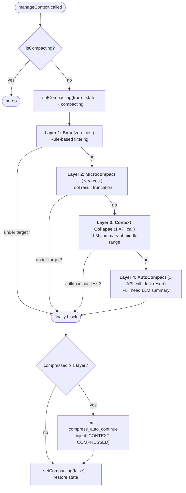

### 3.1 Layer 1: Snip (Zero API Cost)

Pure rule-based filtering — removes low-value messages with no API calls.

**Rules:**
1. Remove tool results where content is empty or trivial (< 20 characters) — *unless* the content contains error patterns (`Error`, `FAILED`, `denied`, `exception`, etc.)
2. Strip orphaned assistant `tool_calls` when ALL corresponding results were removed
3. Suppress duplicate consecutive user messages (identical content)

**Cache protection:** Messages at indices ≤ `cachePrefixEnd` are never touched, preserving API-side prompt caching.

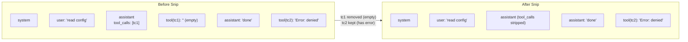

### 3.2 Layer 2: Microcompact (Zero API Cost)

Truncates excessively long tool results in-place. No message count change — string truncation only.

- Tool results > 20,000 characters → truncated to 20K + `...[truncated]`
- Cache prefix messages protected
- Only acts on `role: 'tool'` messages
- Mutates messages in place (no allocations)

### 3.3 Layer 3: Context Collapse (1 API Call)

Summarizes the "middle" of a conversation, preserving edges. Cheaper than full AutoCompact — only processes middle messages.

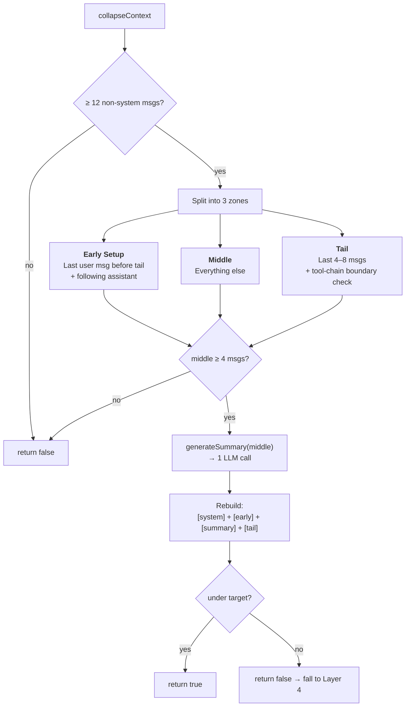

**Early setup preserves the LAST user message before the tail** (the current instruction), not the first. This fixed a critical bug where old "revert everything" instructions overrode the current task.

### 3.4 Layer 4: AutoCompact (1 API Call, Last Resort)

Full head summarization. Guaranteed to bring context under threshold.

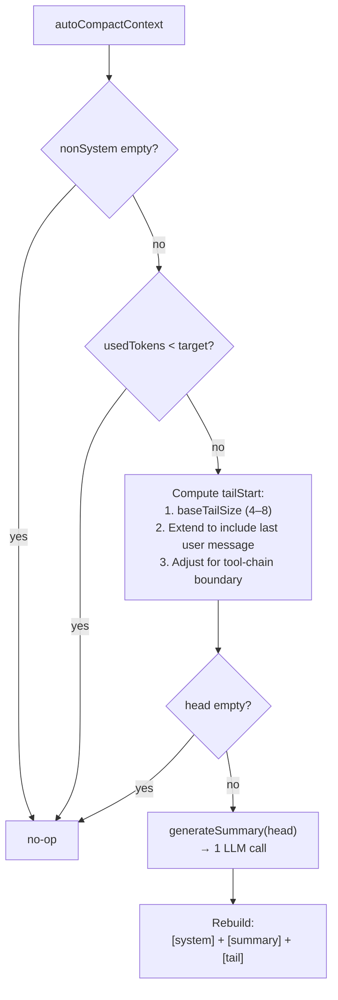

**Three critical protections:**
1. **Last user message ALWAYS preserved verbatim** — tail extends backward to include it
2. **Tool-call chain integrity** — `ensureToolChainBoundary()` scans backward to prevent orphan tool results
3. **Summary quality validation** — rejects boilerplate, requires content signals (file extensions, action verbs)

### 3.5 Recency Preservation in Summaries

The summary prompt explicitly tags user messages by recency so the summary LLM prioritizes the current task:

```
user [OLD — historical context, task may already be complete]: revert all changes
user [OLD — historical context]: add frontend feature X
user [LATEST — CURRENT INSTRUCTION — this is what you should be working on RIGHT NOW]: remove color scheme
```

The compact prompt template includes:

> CRITICAL — RECENCY: The LAST user message (marked [LATEST]) is THE CURRENT TASK. Earlier user messages (marked [OLD]) are HISTORICAL CONTEXT — completed or superseded tasks. Do NOT conflate old requests with the current work.

### 3.6 Summary Generation & Validation

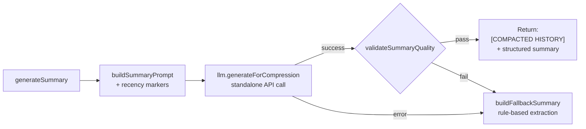

**Quality validation** — summary is rejected if:
- Length < 50 characters
- Contains boilerplate ("I don't have", "Could you please", "I cannot"...)
- Lacks content signals (file extension, path, action verb, or technical keyword)

### 3.7 Continuation Signal

After any layer compresses, a system message is injected so the LLM knows to resume working rather than re-analyze from scratch:

```
[CONTEXT COMPRESSED] Your conversation history was just compressed.
The summary above describes previous work. Continue from where you left off —
tasks are NOT complete. Do NOT re-analyze or produce a text response.
Call tools immediately to resume working.
```

The `compress_auto_continue` event is emitted simultaneously — the TUI displays `[compress] auto-continuing…`. Duplicate prevention ensures only one signal is injected even if multiple layers fire.

### 3.8 Sub-agent Isolation

Sub-agents (dispatched via the `task` tool) create **independent `SpicaAgent` instances** with their own LLM clients, message lists, and context windows. The parent agent's compression never affects sub-agents. Mid-loop compression cannot fire during sub-agent execution — the parent's event loop is blocked inside `executeTools()` waiting for sub-agent completion.

---

## 4. LLM Client & Provider

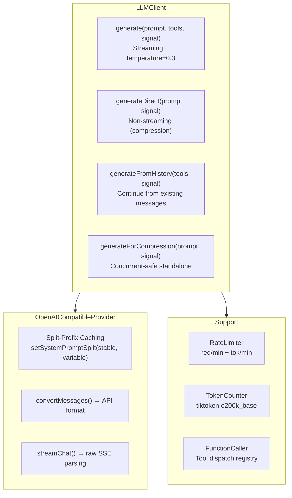

### Split-Prefix Caching

System prompts are split into stable and variable parts:

| Message | Content | API-Cached? |
|---------|---------|-------------|
| `message[0]` | Stable prompt (CLAUDE.md, tool schemas) | ✅ Always |
| `message[1]` | Variable (skills, learnings, progress) | ❌ Session-specific |

After `setMessages()`, the cache prefix resets to -1. Compression restores it to cover system messages.

### Retry Strategy

`callLLMWithRetry()` wraps all LLM calls with 10 retries, exponential backoff, and AbortSignal awareness — transient errors (network, 429, 5xx) retry; permanent errors (401, 403) don't.

---

## 5. Tools & Sub-agents

### 5.1 Tool System

| Category | Tools |
|----------|-------|
| **File (11)** | `read` `write` `edit` `file_multi_edit` `file_replace` `file_insert` `file_delete` `file_copy` `file_move` `file_exists` `file_patch` |
| **Search (4)** | `glob` `grep` `directory_list` `directory_create` |
| **Shell (6)** | `bash` `monitor` `task_stop` `reply_subagent` `git` `workspace` |
| **Quality (5)** | `lint` `test` `format` `code_health` `test_quality_check` |
| **Web (3)** | `web_search` `web_fetch` `gh` |
| **Task (5)** | `todo_write` `todo_read` `task` `skill` `question` |
| **Subagent (1)** | `reply_subagent` |

Auto-features: syntax check on write/edit, lazy tool loading (16 tools withheld until first use, saves ~1,500 tok/call), 30s tool result cache, 8K output cap.

### 5.2 Tool Conflict Detection

| Conflict | Resolution |
|----------|-----------|
| Same file writes | Sequential (order preserved) |
| Read + Write (same file) | Write after read |
| Different files | Parallel |
| Git operations | Single `git:repo` resource |

### 5.3 Sub-agents

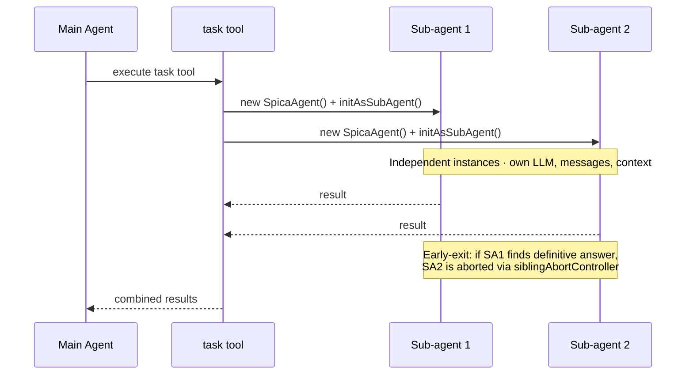

| Type | Allowed Tools | Worktree Isolation |
|------|--------------|-------------------|
| `explore` | glob, grep, read, directory | No |
| `review` | explore + lint | No |
| `fix` | read, edit, bash, lint | Optional |
| `build` | all tools | Optional |

Max 3 parallel sub-agents. Implementation types (fix/build) emit warnings if >1 run in parallel to prevent git conflicts.

---

## 6. Session & Persistence

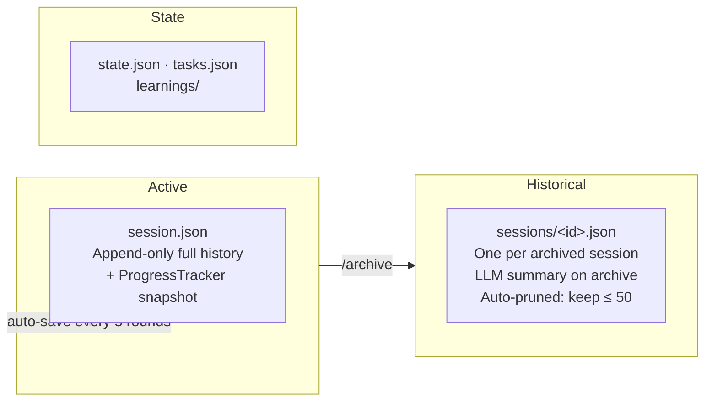

Key invariants:
- `_fullHistory` is append-only — only provider messages are compressed
- System prompts live ONLY in `provider.msgs`, never in `_fullHistory`
- `syncFullHistory()` uses index-based tracking to avoid desync after `cleanMessages()`

---

## 7. Interrupt & Recovery

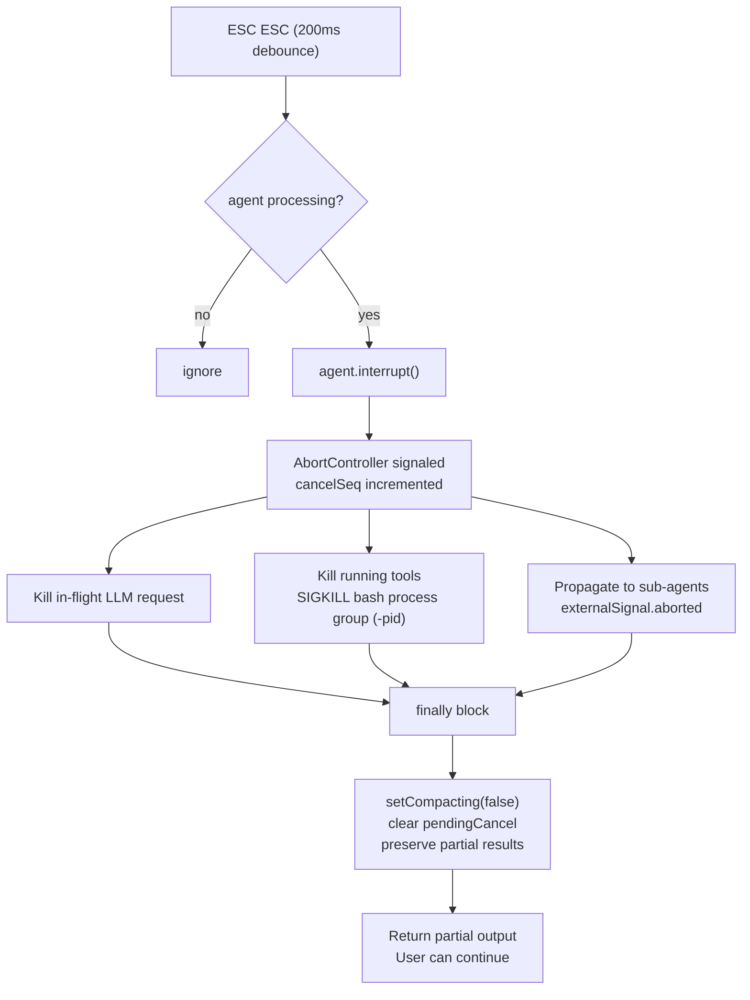

`cancelSeq` prevents a race condition: if abort fires between tool completion and result processing, stale results are discarded.

---

## 8. CLI / TUI

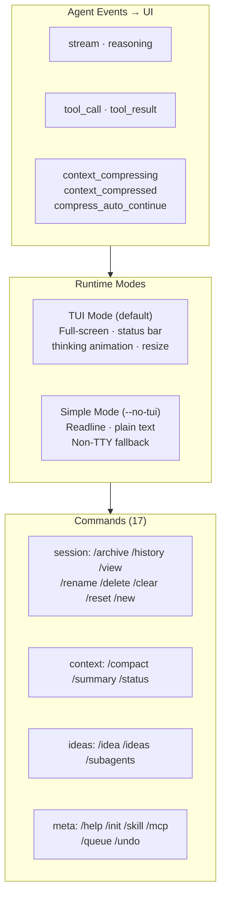

Input Queue: during agent processing, new user input buffers into a queue (max 50). Multiple entries merged with separators. `/queue` shows pending; `/undo` removes last. Auto-drains after processing completes.

---

## 9. Storage Layout

```
~/.spica/                          # Global config
├── settings.json                  # Providers, MCP, hooks, skills
├── skills/                        # Custom skill packages
├── sessions/                      # Archived sessions
└── learnings/                     # Global corrections

<project>/.spica/                  # Per-project
├── session.json                   # Active session (append-only full history)
├── sessions/                      # Historical sessions (one per archive)
├── state.json                     # Project state (todos, decisions, phase)
├── tasks.json                     # Persisted task list
├── tool-usage.json                # Per-tool analytics → feeds lazy loading
├── ideas.json                     # Captured ideas (/idea command)
├── backups/                       # Auto-backup before every write/edit
├── hooks.json                     # Project-level tool hooks (strictness ≥ global)
└── skills.json                    # Project-level skill overrides
```

---

## 10. Installation & Usage

```bash
git clone https://github.com/zisonzishen0415-stack/spica-cli
cd spica-cli
npm install && npm run build && npm link
```

```bash
spica set <name> <base-url> <api-key> <model>   # add a provider
spica use <name>                                 # switch to it
spica                                            # interactive mode
spica run "fix the bug"                          # single task
```

Supports any OpenAI-compatible API (OpenAI, Anthropic via proxy, DeepSeek, Gemini, Groq, local models).

### Commands

| Command | Description |
|---------|-------------|
| `/help` | List all commands |
| `/init` | Initialize CLAUDE.md for current project |
| `/archive` | Archive session + summary, start new |
| `/history` | Browse past sessions |
| `/view <id>` | View session detail |
| `/compact` | Manually compress context |
| `/summary` | Session progress summary |
| `/status` | Token usage, model, branch |
| `/idea` | Capture ideas during coding |
| `/subagents` | View subagent history |
| `/skill` | Manage skills |
| `/mcp` | Manage MCP connections |
| `/queue` / `/q` | Show or undo queued inputs |

### Development

```bash
npm run dev          # dev mode (tsx)
npm run build        # build executable
npm test             # tests (vitest, 750+ tests)
npm run test:run     # run once
npm run lint:strict  # CI-ready lint
npx tsc --noEmit     # type check
```

---

## 11. Further Documentation

- [MANUAL.md](docs/MANUAL.md) — Complete user manual
- [CONTRIBUTING.md](docs/CONTRIBUTING.md) — Contributing guide
- [STYLE_GUIDE.md](docs/STYLE_GUIDE.md) — Technical writing conventions
- [docs/architecture.mermaid](docs/architecture.mermaid) — Legacy full architecture diagram (Mermaid source)
- [docs/architecture_cn.mermaid](docs/architecture_cn.mermaid) — Legacy full architecture diagram (Chinese)

## License

MIT
