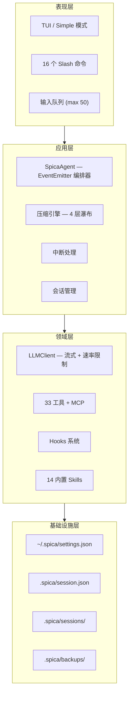
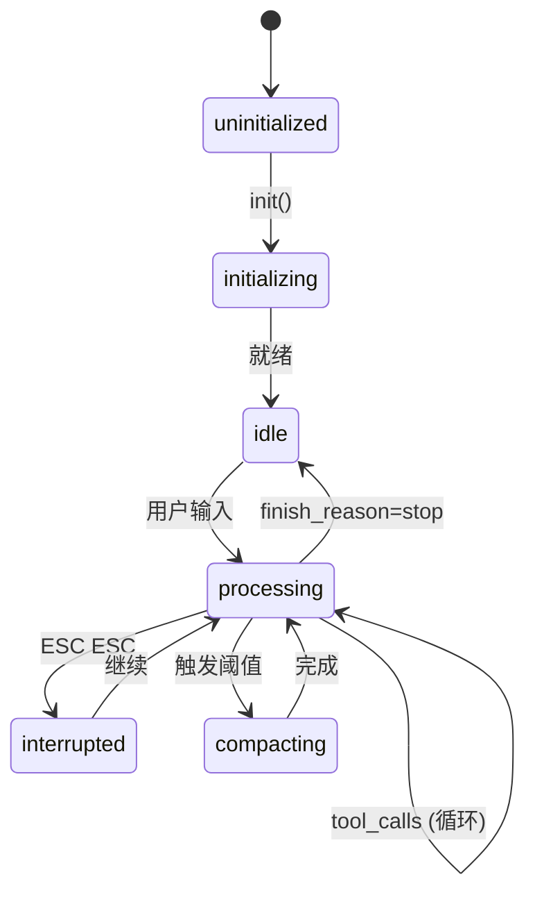
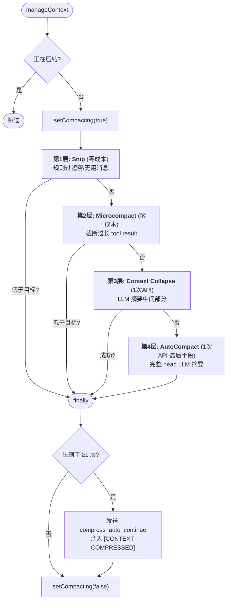
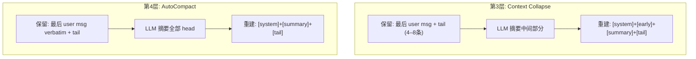
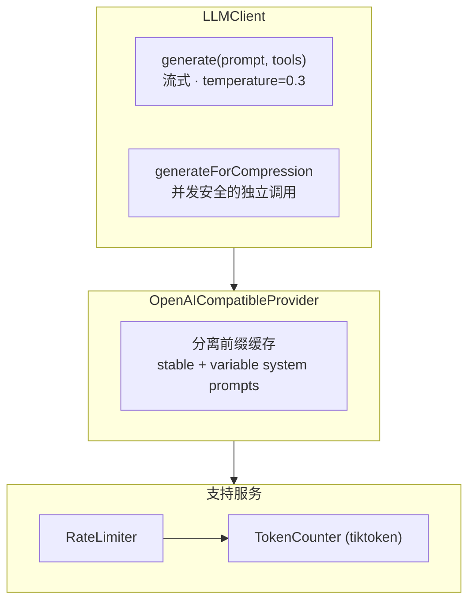

# spica — AI 编程助手 CLI

```
              _)
   __|  __ \   |   __|   _` |
 \__ \  |   |  |  (     (   |
 ____/  .__/  _| \___| \__,_|
       _|
```

终端里的 AI coding agent。帮你写代码、改代码、跑命令——交互式和单任务都行。

[](https://opensource.org/licenses/MIT)
[](https://nodejs.org)
[](https://www.typescriptlang.org/)

[English](README.md) | [中文](README_CN.md)

---

## 概述

Spica 是一个终端原生的 AI 编程助手。它维护跨轮次的持久会话，执行工具（文件操作、shell、git、web），并在上下文接近 LLM 窗口上限时自动压缩。架构分为四层——表现层 → 应用层 → 领域层 → 基础设施层——包含 4 层压缩瀑布、tiktoken 精确计数、子代理分发和中断安全执行。TypeScript ESM 构建，兼容任何 OpenAI 兼容 API。

---

## 1. 架构总览



**核心架构不变式 — 消息三元分离：**

| 存储 | 用途 | 被截断？ |
|------|------|---------|
| `_fullHistory` | 会话持久化 (`session.json`) | 从不 — 只追加 |
| `provider.msgs` | LLM API 上下文 | 是 — 压缩瀑布 |
| `toolDefs` | API `tools` 参数 | 否 — 懒加载，节省 ~1,500 tok/次 |

系统提示词仅存在于 `provider.msgs`，从不同步到 `_fullHistory`。每个会话文件节省约 5,500 tokens。

---

## 2. Agent 核心循环



### 处理流水线

```
processInput(prompt)
  │
  ├─ 1. Token 检查 (按上下文窗口大小自适应阈值)
  │      └─ 超阈值 → manageContext(target)   [见 §3]
  ├─ 2. 注入 ProgressTracker 上下文块 (压缩后仍存活)
  ├─ 3. callLLMWithRetry(prompt, toolDefs, maxRetries=10)
  ├─ 4. syncFullHistory() → 基于索引同步
  └─ 5. 工具执行循环:
       每 4 轮检查 mid-loop 压缩 · 队列检查 · 停滞检测
```

### 自适应阈值

| 上下文窗口 | 请求前触发 | 请求前目标 | 循环中触发 | 循环中目标 |
|-----------|-----------|-----------|-----------|-----------|
| < 32K | 55% | 48% | 65% | 55% |
| 32K–64K | 70% | 55% | 80% | 65% |
| 64K–200K | 80% | 60% | 88% | 72% |
| ≥ 200K | 85% | 65% | 92% | 78% |

---

## 3. 上下文压缩

4 层成本递进瀑布。每层逐步增强，一旦上下文降到目标阈值以下就提前返回。



### 3.1 Snip & Microcompact (零 API 成本)

- **Snip**: 移除空 tool result (< 20 chars)、孤儿 assistant tool_calls、连续重复 user 消息。cache prefix 内消息保护不删
- **Microcompact**: tool result > 20K chars → 截断为 20K + `...[truncated]`

### 3.2 Context Collapse & AutoCompact (LLM 摘要)



### 3.3 时效性保护

摘要 prompt 显式标记用户消息的时效性：

```
user [OLD — 历史上下文，任务可能已完成]: 回退所有改动
user [LATEST — 当前指令，正在执行中]: 去掉配色方案系统
```

摘要 prompt 模板包含：

> 关键 — 时效性: 最后一条 user 消息 (标记 [LATEST]) 是当前任务。更早的 user 消息 (标记 [OLD]) 是历史上下文——已完成或已废弃。不要把旧请求和当前工作混淆。

### 3.4 摘要生成与验证

`generateSummary` → `buildSummaryPrompt`(+ 时效性标记) → `llm.generateForCompression`(独立 API 调用) → `validateSummaryQuality`(拒绝空/模板/无内容信号) → 失败则回退到 `buildFallbackSummary`(规则提取)

### 3.5 继续信号

压缩后注入 `[CONTEXT COMPRESSED]` system 消息："你的对话历史刚刚被压缩。继续你之前的工作——任务未完成。不要重新分析或输出文本，立即调用工具恢复工作。"

### 3.6 子代理隔离

子代理（通过 `task` 工具分派）创建**独立的 `SpicaAgent` 实例**，拥有自己的 LLM 客户端、消息列表和上下文窗口。父代理的压缩永远不会影响子代理。子代理运行期间 mid-loop 压缩不会触发——父代理的事件循环在 `executeTools()` 内阻塞等待子代理完成。

---

## 4. LLM 客户端 & Provider



**分离前缀缓存**: `message[0]` = 稳定 prompt (CLAUDE.md, tool schemas) 始终缓存; `message[1]` = 可变部分 (skills, learnings)。`setMessages()` 后重置为 -1，压缩后恢复。

---

## 5. 工具 & 子代理

| 类别 | 工具 |
|------|------|
| 文件 (11) | `read` `write` `edit` `file_multi_edit` `file_replace` `file_insert` `file_delete` `file_copy` `file_move` `file_exists` `file_patch` |
| 搜索 (4) | `glob` `grep` `directory_list` `directory_create` |
| Shell (5) | `bash` `monitor` `task_stop` `git` `workspace` |
| 质量 (5) | `lint` `test` `format` `code_health` `test_quality_check` |
| Web (3) | `web_search` `web_fetch` `gh` |
| 任务 (5) | `todo_write` `todo_read` `task` `skill` `question` |

**工具冲突检测**: 同文件写入 → 顺序执行; 不同文件 → 并行; git → 单一资源锁。

**子代理类型**: `explore`(只读) · `review`(+lint) · `fix`(读/写/bash) · `build`(全部工具)。最多 3 个并行。支持隔离 git worktree。

---

## 6. 会话与持久化

```
活跃会话: session.json (只追加完整历史 + ProgressTracker 快照)
         ↓ /archive
历史会话: sessions/<id>.json (LLM 摘要 · 自动清理保留 50 个)
```

核心不变式: `_fullHistory` 只追加，永不被压缩。系统 prompt 仅在 `provider.msgs` 中。每 5 轮自动保存。

---

## 7. 中断与恢复

```
ESC ESC (200ms 防抖)
  → agent.interrupt()
    → AbortController 信号 + cancelSeq++
    → 杀死 LLM 请求 · 杀死工具进程 (SIGKILL -pid) · 传播到子代理
    → finally: 清理状态 · 保留部分结果 · 用户可继续
```

`cancelSeq` 防止竞态：abort 在工具完成和结果处理之间触发时，过期结果被丢弃。

---

## 8. 存储布局

```
~/.spica/                    # 全局配置
├── settings.json            # Providers, MCP, hooks, skills
├── skills/                  # 自定义 skill 包
└── learnings/               # 全局纠正

<project>/.spica/            # 项目级
├── session.json             # 活跃会话 (只追加)
├── sessions/                # 历史会话
├── state.json               # 项目状态
├── tasks.json               # 持久化任务列表
├── tool-usage.json          # 工具使用分析
├── snapshots/               # Checkpoint 快照
├── backups/                 # 写入前自动备份
└── hooks.json               # 项目 hooks
```

---

## 9. 安装与使用

```bash
git clone https://github.com/zisonzishen0415-stack/spica-cli
cd spica-cli
npm install && npm run build && npm link
```

```bash
spica set <name> <base-url> <api-key> <model>   # 添加 provider
spica use <name>                                 # 切换
spica                                            # 交互模式
spica run "fix the bug"                          # 单次任务
```

### 命令

| 命令 | 说明 |
|------|------|
| `/help` | 命令列表 |
| `/archive` | 归档会话 + 摘要 |
| `/history` | 浏览历史会话 |
| `/compact` | 手动压缩上下文 |
| `/summary` | 会话进度摘要 |
| `/status` | Token 用量、模型、分支 |
| `/checkpoint` | 文件快照管理 |
| `/skill` / `/mcp` | Skills / MCP 管理 |
| `/queue` | 显示或撤销排队输入 |

### 开发

```bash
npm run dev          # 开发模式 (tsx)
npm run build        # 构建
npm test             # 测试 (vitest, 701 测试)
npm run lint:strict  # CI 级 lint
npx tsc --noEmit     # 类型检查
```

## 10. 更多文档

- [MANUAL.md](docs/MANUAL.md) — 完整用户手册
- [CONTRIBUTING.md](docs/CONTRIBUTING.md) — 贡献指南
- [STYLE_GUIDE.md](docs/STYLE_GUIDE.md) — 技术文档风格规范

## License

MIT
