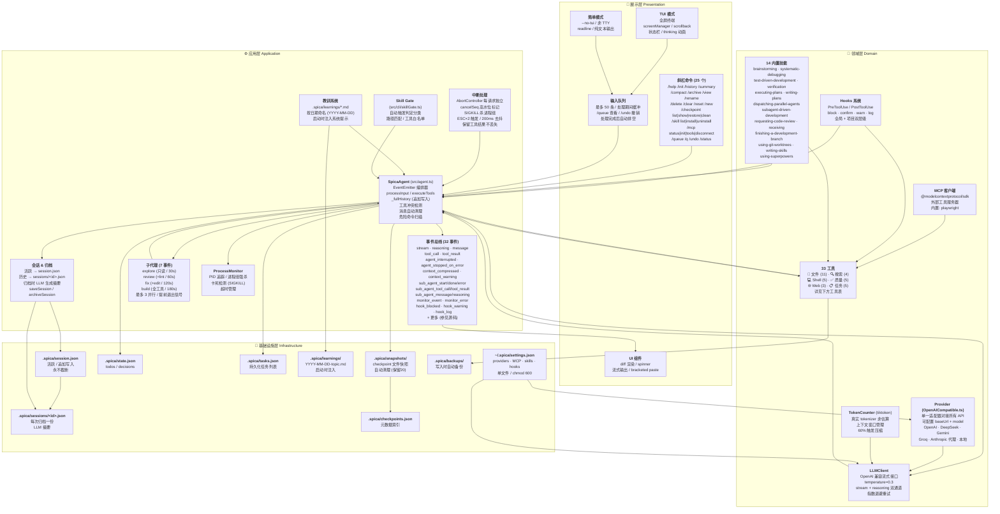
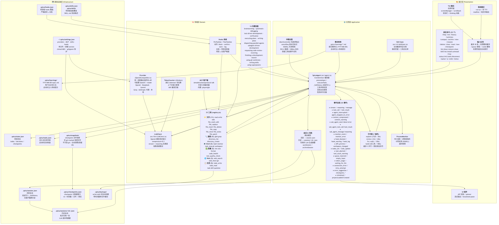

# spica - AI coding agent CLI

```
              _)
   __|  __ \   |   __|   _` |
 \__ \  |   |  |  (     (   |
 ____/  .__/  _| \___| \__,_|
       _|
```

终端里的 AI coding agent。帮你写代码、改代码、跑命令——交互式和单任务都行。

[](https://opensource.org/licenses/MIT)
[](https://nodejs.org)
[](https://www.typescriptlang.org/)

[English](README.md) | [中文](README_CN.md)

## 安装

```bash
git clone https://github.com/zisonzishen0415-stack/spica-cli
cd spica-cli
npm install && npm run build && npm link
```

## 使用

```bash
spica set <name> <base-url> <api-key> <model>   # 添加 provider
spica use <name>                                 # 切换到该 provider
spica                                            # 交互模式
spica run "fix the bug"                          # 单次任务
```

## 特性

- **工具批处理** — 并行读取、并行写入（同文件冲突检测），每轮一次 LLM 往返
- **tiktoken 精确计数** — 真实 tokenizer 而非估算，60% 窗口触发压缩
- **双阶段压缩** — 即时规则截断 + 后台 LLM 摘要
- **8K 输出截断** — 大结果自动截断，按需 `offset`/`limit` 再读
- **Prompt cache 感知** — 消息前缀稳定化，命中 OpenAI 缓存
- **Checkpoint** — 文件快照存 `.spica/snapshots/`，不污染 git，自动清理
- **Learnings** — `.spica/learnings/` 持久化你的纠正，跨 session 生效
- **会话管理** — `/archive`、`/clear`、`/history`；归档+摘要，不丢记录
- **14 个内置 skill** — brainstorming、TDD、debugging、code review 等
- **中断安全** — ESC ESC 中断，tool 结果和消息序列不损坏
- **子代理** — `task` 工具分派 3 个并行代理
- **Windows 兼容** — PowerShell 回退，跨平台 bin 脚本
- **MCP 扩展** — Model Context Protocol 接入外部工具
- **TUI** — 流式输出、思考动画、compact 模式、resize 处理

## 架构

> 源码: [docs/architecture_cn.mermaid](docs/architecture_cn.mermaid)。渲染: [docs/architecture_cn.png](docs/architecture_cn.png)





Mermaid 源码: [docs/architecture_cn.mermaid](docs/architecture_cn.mermaid)<br/>
渲染: `mmdc -i docs/architecture_cn.mermaid -o docs/architecture_cn.png -w 2400 -H 3600 -b white -s 2`

## 工具

| 类别 | 工具 |
|------|------|
| 文件 | `read` `write` `edit` `file_multi_edit` `file_replace` `file_insert` `file_delete` `file_copy` `file_move` `file_exists` `file_patch` |
| 搜索 | `glob` `grep` `directory_list` `directory_create` |
| Shell | `bash` `monitor` `task_stop` `git` `workspace` |
| 质量 | `lint` `test` `format` `code_health` `test_quality_check` |
| Web | `web_search` `web_fetch` `gh` |
| 任务 | `todo_write` `todo_read` `task` `skill` `question` |

## 命令

| 命令 | 说明 |
|------|------|
| `/help` | 命令列表 |
| `/init` | 为当前项目初始化 AGENTS.md |
| `/archive` | 归档会话+摘要，开始新会话 |
| `/history` | 浏览历史会话或消息历史 |
| `/view` | 查看会话详情 |
| `/rename` | 重命名会话 |
| `/delete` | 删除会话 |
| `/clear` | 清空当前会话 |
| `/reset` | 重置 agent 状态 |
| `/new` | 开始全新会话 |
| `/summary` | 当前会话进度摘要 |
| `/compact` | 压缩上下文 |
| `/checkpoint` | Checkpoint 管理（列表、查看、恢复、清理） |
| `/skill` | Skill 管理（列表、安装、卸载） |
| `/mcp` | MCP 管理（状态、初始化、工具、断开） |
| `/status` | 会话状态（token、模型、分支） |
| `/queue` | 显示或撤销排队输入 |
| `/q` | /queue 的快捷方式 |

## 配置

```
~/.spica/settings.json    # 全局
<project>/.spica/         # 项目级
```

## 开发

```bash
npm run dev      # 开发模式 (tsx)
npm run build    # 构建
npm test         # 测试 (vitest)
npm run lint     # lint
```

## 文档

- [MANUAL.md](docs/MANUAL.md)
- [CONTRIBUTING.md](docs/CONTRIBUTING.md)

## License

MIT
